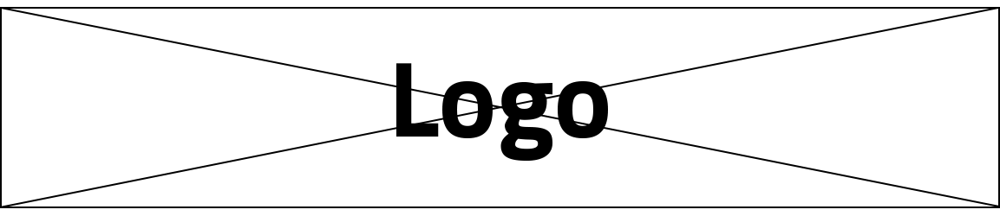

L'altro titolo per il documento
===============================

.. highlights:: 
        
   Questo è un documento di test. Viene usato per testare alcune funzionalità di Sphinx e Docs Italia.
   Se il sommario è troppo lungo, potrebbe finire su più righe. 
   Un'altra riga di test. E un'altra ancora

   È possibile separare i paragrafi, se necessario?

   Aggiungere una riga.
   
   Aggiungere un'altra riga.

.. centered:: TESTO CENTRATO

Un paragrafo aggiuntivo...

Mappa dei box
-------------

.. attention::
        Attenzione! [attention]

.. caution:: 
        [caution]

.. danger::
        Pericolo!! [danger]

.. error::
        Errore [error]

.. hint::
        Suggerimento [hint]

.. important::
        Importante [important]

.. note:: 
        Questa è una nota [note]

.. tip::
        Suggerimento [tip]

.. warning:: 
        Attenzione! Lingua sconosciuta

.. admonition:: Nota importante

   Questa è una nota personalizzata. [admonition]

.. admonition:: Esempio

   Admonition di esempio.

Testo
-----

Lorem ipsum dolor sit amet, consectetur adipiscing elit. Nulla dignissim
purus mauris. Nam vitae semper eros. Curabitur luctus nisl neque, vitae
vehicula eros consectetur eu. Curabitur orci lacus, vehicula eu lacinia
sit amet, ornare condimentum ligula. Pellentesque at nibh non purus
porttitor scelerisque vitae sed purus. Etiam enim tellus, pellentesque
at interdum eget, euismod ut nisl. Nam consectetur nunc sapien, sit amet
molestie metus malesuada nec.

Nunc varius ultrices felis, eget efficitur sapien pulvinar sed. Morbi
semper iaculis pulvinar. Donec sapien purus, commodo in aliquam quis,
ullamcorper vitae diam. Donec a nibh suscipit, semper ante non,
consectetur nunc. Phasellus non feugiat ante. Quisque nec ante eu purus
ornare dignissim. Nunc viverra, sapien ut sagittis bibendum, ante elit
eleifend nisl, vitae semper purus odio sed erat. Maecenas a orci nulla.
Mauris consectetur ligula justo, eu sagittis nisl accumsan ac. Phasellus
lacus velit, convallis vel venenatis ac, posuere quis erat. Phasellus
commodo lectus sit amet risus elementum porttitor. In pharetra est ut
eros sagittis feugiat. Cras nec suscipit odio. Duis in orci sed ante
convallis varius.

Etiam eleifend felis quis arcu finibus malesuada. Nulla cursus ex a odio
suscipit, ac cursus quam consectetur. Aenean feugiat magna ut turpis
venenatis, sed malesuada massa commodo. Nulla hendrerit in libero quis
vestibulum. Proin pulvinar tellus eu bibendum consectetur. Suspendisse
sodales ipsum sed neque commodo mollis. Nunc accumsan, odio nec
consequat elementum, nisl ex faucibus odio, a pharetra leo lacus iaculis
ante. Nulla lacinia suscipit risus, et dapibus dui mattis ac.

.. _fig1:

   Questa è la didascalia alla figura.

|Libri antichi con copertina rigida su uno scaffale.|

Questo testo continua dopo l'immagine :numref:`fig1`, cui fa riferimento.

.. _tab1:

.. table:: Titolo della tabella
   
   +--------+-----------+-----------------------+
   | numero | oggetto   | nome del protagonista |
   +========+===========+=======================+
   | 1      | mela      | Biancaneve            |
   +--------+-----------+-----------------------+
   | 2      | scarpetta | Cenerentola           |
   +--------+-----------+-----------------------+

Questa invece è una tabella, cui posso fare riferimento (vedi :numref:`Tabella %s <tab1>`).

.. tabularcolumns:: |p{1cm}|p{7cm}|

.. csv-table:: Lorem Ipsum
   :file: lorem-tab.csv 
   :header-rows: 1 
   :class: longtable
   :widths: 1 1

   
Elenchi
-------

Elenco puntato stretto.

- item 1
- item 2
- item 3

Elenco puntato largo.

- item 1

- item 2

- item 3
